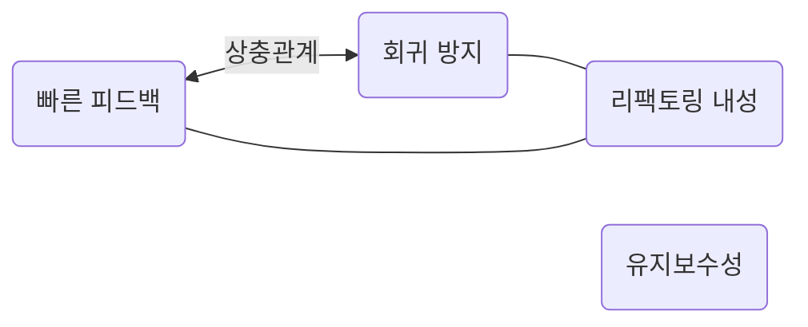

# 1. 단위테스트 Golden Circle

> 최소의 비용으로 최대의 가치 달성

### Why: 치명적인 버그가 없는 프로덕트 코드를 위해

### How: 좋은 단위테스트를 통해서

### what: 좋은 단위테스트 정의, 방법론, 좋은 라이브러리

* 설계가 좋아지는것은 덤
* 프로덕트 코드의 품질도 덤

설계가 좋아지고 프로덕트 코드의 품질 그 자체가 좋아지는게 목적이 된다면, 절대선을 위해 생산성 저하도 허용될수 있음

* 테스트코드가 생산성 저하를 가져오지않으면서 지속가능한 프로덕트 성장과 조화를 이룰 때, 진짜 가치가 있다고 볼 수 있다.
* 테스트의 비용 / 편익을 고려 불필요한 테스트를 작성하지 않는것이 중요 => 좋지 못한 테스트 코드는 또 다른 기술부채
* 단위 테스트 / 코드 커버리지 모두 나쁜 긍정지표일뿐, 이것이 프로덕트 코드를 의미하는것은 아님

# 2. 단위 테스트의 정의

* \[v] 작은 코드 조각을 검증하고
* \[v] 빠르게 수행하고
* \[?] 격리된 방식으로 처리한느 자동화된 테스트

> 어디까지 격리할 것인가?

| | 고전파 | 런던파 |
|--------|--------|--------|
| 격리문제 | 단위 테스트간의 격리 / 하나의 실행 컨텍스트에서 여러 객체 테스트 가능 | 모든 테스트 협력 대상을 SUT에서 격리 / 모든 의존성 격리
|단위의 크기 | 단일 클래스 or 클래스 세트 | 단일 클래스
| 테스트 대역 사용 대상 | 공유 의존성 | 불변 의존성 외 모든 의존성

## 격리문제

격리가 될수록 테스트가 가벼워지고 버그 특정이 쉬워짐
의존성 그래프를 그릴 필요가 없어지므로 편해짐

하지만 상호 연결된 클래스의 크고 복잡한 그래프를 테스트할 방법을 찾는게 중요한것이 아니라 애초에 그렇게 안짜여지는것이 중요

이는 설계의 문제다.

목을 적극사용하면 이러한 문제를 무시할수 있을뿐, 문제를 해결하는 방법이 아니다.

목을 안쓰고 목을 안쓸때 given을 준비하기 쉬워지는 설계를 하는것이 코드 품질을 높이는 방법

## 단위의 크기 - 테스트의 단위(Unit)의 사이즈는 어느정도인가?

* 클래스를 최소 원자 단위 빌딩 블록으로 보고 함수 하나를 그 단위 테스트 항목으로 보는것이 바람직할까?
* 함수 하나는 비즈니스적으로 유효하지 않을수도 있음
* 결국 문제영역에 의미있는, 비즈니스 담당자가 유용하다고 인식할 수 있는것이 단위(unit)가 되어야함이 바람직하지 않을까?
* 그렇다면 해결하고자 하는 문제 단위 하나가 중요한 것이지, 그 문제해결에 몇개의 클래스가 엮여있는가는 중요하지 않음
* 묻지 말고 시켜라라는 객체지향적 관점에서도 동일하다. public Api의 In/Out 검증이 중요한것이지, 그 public Api의 구현이 중요한것인가?

> * 강아지를 부르면, 강아지는 온다
> * 강아지를 부르면, 강아지의 왼쪽앞다리가 움직이고, 오른쪽 앞다리가 움직이고, 머리를 돌리고, 꼬리를 흔들고, 오른쪽 뒷다리가움직이고.......걷는다

비즈니스적으로 구분짓는 단위가 중요한 것.

* 기본적으로 메서드를 나누는 단위는 가독성과 재사용의 단위이지 비즈니스적인 단위가아님.

-> 고전파 논리가 더 유용함

## 과다 명세 문제

* 목 사용은 테스트가 구현에 더 자주 결합되는 문제가 있다!
* 협력자에 대해서는 목(스텁) 보다는 fake, fake보다는 실제 객체를 사용하는것이 더 바람직
* 목킹은 공유 의존성에만 하는것이 좋다
* 공유 의존성을 대역으로 쓰는 순간부터는 이는 통합테스트?
*

## 통합테스트가 무엇일까?

* \[v] 작은 코드 조각을 검증하고
* \[v] 빠르게 수행하고
* \[?] 격리된 방식으로 처리한느 자동화된 테스트

단위테스트 정의에 하나라도 부합하지 않으면 통합테스트.

결국 격리된 방식의 범위이며 의존성을 어떤것을 가져가느냐의 문제.

공유의존성에 접근한다면 통합테스트.

그럼 공유의존성을 fake를 쓰면?

# AAA / GWT 패턴

## 준비 구절이 큰 문제점

* 테스트 데이터 빌더 / 오브젝트 마더 패턴으로 해결하라

## 실행구절이 여러개인경우

* 테스트는 기본적으로 Input / Output 검증이 원칙
* 여러 실행구절이 존재한다는것은 캡슐화가 깨지고 구현이 드러나는셈
* 클라이언트에 제공되는 public api 관점에서 여러 api가 하나의 트랜잭션으로 묶여야한다면 이는 공개 api를 잘못 만든 셈
* 위 관점에서 단순 단일 메서드의 테스트 검증이 의미없다는 뜻이기도하다. 단위 테스트의 단위는 하나의 비즈니스 문제를 해결하는 단위여야하며, 어그리게이트 루트도 그러한 단위로 api가 제공되어야함!

# 1. 회귀 방지

> 회귀 : 소프트 웨어 버그 / 코드를 수정한 후 기능이 의도한 대로 작동하지 않는 경우

###  회귀방지 주요 지표
- 테스트 중에 실행하는 코드의 양 - 테스트 코드 분량
- 코드 복잡도 - 단순한 코드인지 아닌지
- 코드의 도메인 유의성 - 얼마나 비즈니스 임팩트가 있는 코드인지


# 2. 리팩토링 내성

> 리팩토링 정의 : 식별할 수 있는 동작을 수정하지 않고 기존 코드를 변경하는것을 의미 / 비기능적 특징을 개선하는것으로 가독성을 높이고 복잡도를 낮추는것

- 위양성(1종 오류) 피하기

### 테스트의 목적은 지속가능한 프로덕트의 성장을 보조하는것

- 조기 경보 - 버그를 찾아주는 역할이 핵심

거짓 양성이 누적되면

- 테스트가 타당한 이유없이 실패하면 양성반응에 대한 신뢰도가 떨어지고 믿을만한 안전망으로 인식하기 않음 / 테스트의 신뢰도 감소
- 리팩토링 저항감으로 코드 품질 저하

### 테스트 코드가 위양성을 일으키는 원인은 무엇인가?

> 테스트 대상(SUT)가 구현 세부사항과 많이 결합할수록 / 구현 세부사항을 테스트할수록


=> 행위검증을 하는게 아니라 상태검증을 해야함


# 1, 2 지표 통합 정리


|  | 작동 | 버그 |
|--------|--------| -|
| 테스트 통과 | 음성 | 위음성
| 테스트 실패 | 위양성 | 양성

### 위음성 : 회귀방지에 악영향
### 위양성 : 리팩토링 내성에 악영향

테스트 정확도 = (양성 /  양성 + 위양성) * 50 + (음성 / 위음성 + 음성) * 50

=> 양성을 잘 잡아내고, 위양성을 줄이고 / 음성시 위음성을 줄이면 정확한 테스트가 된다.

- 양성을 잘 잡아내려면 테스트 코드가 많아야함
- 위양성을 줄이려면 구현 결합도가 낮아야함
- 위음성을 줄이려면 정확한 테스트 코드를 작성해야함


# 3. 빠른 피드백 / 4.유지보수성

- 테스트코드가 얼마나 이해하기 쉬운가 
- 테스트코드가 얼마나 실행하기 쉬운가


# 지표간 관계





### Case:1 E2E Test

- 회귀 방지 : 우수
- 리팩터링 내성 : 우수
- 빠른 피드백 : 나쁨


> 유지보수성 : 나쁨

: 너무 느리고, 유지보수가 나빠 많이 할 수 없다.

### Case2: 단단한 통합테스트

- 회귀 방지 : 중간
- 리팩터링 내성 : 우수
- 빠른 피드백 : 중간

> 유지보수성 : 중간

: 단점이 없는데?

### Case3: 깨지기 쉬운 통합테스트

- 회귀 방지 : 중간
- 리팩터링 내성 : 나쁨
- 빠른 피드백 : 중간

> 유지보수성 : 나쁨

: 리팩터링 내성이 없어 유지보수가 나쁘다. 위양성 반응 문제

### Case4 : 단단한 유닛테스트

- 회귀 방지 : 중간
- 리팩터링 내성 : 우수
- 빠른 피드백 : 중간

> 유지보수성 : 좋음

: 단점이 없는데?

### Case5 : 깨지기 쉬운 단위 테스트

- 회귀 방지 : 중간
- 리팩터링 내성 : 나쁨
- 빠른 피드백 : 중간

> 유지보수성 : 나쁨

: 리팩터링 내성이 없어 유지보수가 나쁘다. 위양성 반응 문제

### Case6 : 단순한 유닛테스트

- 회귀 방지 : 나쁨
- 리팩터링 내성 : 우수
- 빠른 피드백 : 우수

> 유지보수성 : 좋음

: 회귀방지가 없는 테스트 코드가 무슨 의미지?


### 리팩터링 내성이 있는 테스트 코드를 작성해야한다. How?


|  | 리팩토링 내성|
|--------|--------| 
| 화이트박스 | 나쁨
| 블랙박스 | 좋음

테스트가 블랙박스에 가까울수록 리팩토링 내성은 뛰어나다.

진정한 블랙박스에 비해 화이트 박스 테스트의 강점은 코드레벨로 접근함으로써 커버리지 분석과 분기 커버 분석을 통해 더 세세한 검증이 가능

그렇다면 테스트 코드는 블랙박스스럽게 짜고 + 커버리지 분석으로 2차 분석하는것이 좋은 테스트 코드

테스트 코드 자체를 화이트박스스럽게 짜면 구현에 결합되어 리팩토링 내성이 낮아진다.

    


# 테스트 대역(Double)의 종류
> 제라드 메스자로스(Gerard Meszaros)가 만든 용어


## 더미(Dummy)

- 단순히 채우는 용도, 아무런 동작도 정의되어 있지 않으며, 반환값이 중요하지도, 사용되지도 않는 경우
- 단순히 인자값을 채우기 위한 용도
- 테스트 상(SUT)에서도 아무런 상호작용을 하지 않으므로 문제되지 않는다

### 실제 예시

- 이론상 같은함수에서도 특정 분기에 따라 검토하지 않는 인자라면 더미로 넣어도 될것같다

## 목(mock)

- 호출되었을때 행동을 시뮬레이션하며, 어떤 메서드가 호출되었는지, 몇번 호출되었는지 어떤 인자와 함께 호출되었는지 등등 행위 검증을 위해 사용된다.
- 행위에대한 시뮬레이션일 뿐 반환을 하는것은 아니다.


### 실제 예시

- 특정 메서드에서 특정분기의경우 해당 함수를 호출했는지, 몇번 호출했는지 등을 체크할때 사용

## 스텁

- 인풋에대해 사전에 설정된 응답을 해주는 객체로 응답값을 하드코딩한 값 그대로 반환하는 대역

### 실제예시

- mockk로 일반적으로 작성하는 대역이 바로 스텁

## 스파이

- 실제 객체를 감싸서 그 객체의 호출정보를 기록하고 추가정보를 기록

### 실제예시

- 행위에대해 대신 해주는경우보다 단순히 목으로서의 행위검증을 강화하는 역할로 정의하는거같다

## 페이크(fake)

- 실제 동작하는 구현을 가지나, 프로덕트 레벨이 아닌 단순화된 구현만 하는 경우

### 실제 예시

- 인메모리 디비, 컨테이너 디비 등등 실제 디비와 유사한 행위를 하지만 실제 디비는 아닌 경우

## 인풋 아웃풋 관점에서 구분

### 행위검증용

- 목, 스파이

- 반환값이 없음을 전제로 한다


### 상태 검증용

- 스텁 더미 페이크
- 더미 -> 스텁 -> 페이크 순으로 똑똑함


# 테스트 작성

## 스텁으로 상호작용 검증하지 말라

- 스텁을 하는순간 이미 구현이 노출
- 만약 이 스텁에 행위 검증까지 더하면 이는 과잉명세


```kotlin
...
val repository = mockk(){
every save(id) return data
}

sut.do()

verify(repository.save(), times(1))

``` 
- 특정 함수에 특정행동을 하도록 정의하고, 특정 행동을 했는지 확인하는 테스트는 과잉명세일 뿐이다.


 

# 객체지향 & 절차지향 프로그래밍과 동일한 논리


객체지향에서의 Orchestrator => Service

Service => aggregate entity

## Orchestration 방식

- 커뮤니케이션 횟수를 줄일수있음
- 중앙관리 방식으로 비즈니스 로직을 이해하기 쉬움
- 객체간 의존성(암묵적, 명시적 모두)을 제거할수 있음

## Choreography

- 보다 객체지향적 사고방식
- 비즈니스 응집도가 높음, 도메인 집약적인 모델 설계가 가능


## 뭐가 더 낫나

- 유지보수관점, 인지의 편의상 Orchestration이 좀더 편함
- 도메인 집약적인 지식들은 각각의 서비스 / 도메인 모델이 가지고 있고 이 도메인 빌딩 블록들을 제어하는 오케스트레이터가 존재하는 구조가 편하다
 

- 다만 이경우 오케스트레이터가 비즈니스 로직을 안갖도록 계속적인 정적분석, 코드리뷰가 필요

## 방법론적으로

- 비즈니스적으로 굉장히 연관성이 높은 도메인 모델들은 어그리게이트루트로 묶기
- 어그리게이트 루트간의 참조는 암묵적 참조 이하로 낮추기위해 id참조
- 적절한 바운디드 컨텍스트 찾기

## 문제가 되는 복잡한 유즈케이스의 경우?

- 오케스트레이터의 판단이 필요한 케이스를 피할수 없음
- 오케스트레이터가 해당 행위를 할지 안할지는 당연히 해야하는 판단이므로 이것을 도메인로직으로 밀어넣기는 쉽지않다.

1. 판단하는 지식 자체를 CanExecute / Execute 패턴으로 분리는 가능 => 이게 최선인가?
2. 유즈케이스 흐름자체를 짧게 갖고 유즈케이스 Facade로 묶기 => 유즈케이스 뎁스가 깊어지는문제
3. 유즈케이스의 연결을 느슨하게 하기위해 도메인 이벤트로 엮기 => 너무 느슨한거 아닌가? , 트랜잭션의 문제는?


# 통합테스트 정의


### 단위테스트 정의
- 단일 동작 단위 검증
- 빠르게 수행
- 다른 테스트와 별도로 처리

위의 세가지중 하나라도 위반이면 통합테스트

외부 의존성을 모두 목으로 처리하면 단위테스트가 되긴한다.

하지만 이러한 단위테스트가 유의미한가?


| | 협력자수 적음 | 협력자수 많음|
 |--------|--------| ----|
| 도메인 유의성 / 알고리즘 복잡성 높음 | 도메인 / 유틸 알고리즘 | 지나치게 복잡한 코드|
| 도메인 유의성 / 알고리즘 복잡성 낮음 | 간단한 코드 | 오케스트레이터


| | 협력자수 적음 | 협력자수 많음|
 |--------|--------| ----|
| 도메인 유의성 / 알고리즘 복잡성 높음 | 도메인 블록, 매핑유틸(factory) | 있어서는 안된다 /.  리팩토링 대상|
| 도메인 유의성 / 알고리즘 복잡성 낮음 | 간단한 코드 | 유즈케이스 인터렉터, 레포지토리 어댑터


- Rich Domain Building Block => 당연히 단위테스트의 대상
- UseCase Interactor => 단위테스트를 할경우 모든 협력자들을 목킹해야함
- 어댑터들 => 외부 의존성을 단순 목킹한다면 주요한 매핑로직들 단위테스트 대상으로서 확인은 가능


# 통합테스트 핵심 시나리오

- 해피패쓰
- 단위테스트로 커버하지 못하는 엣지 케이스


# 통합테스트시 목킹 여부

## 외부의존성의 분류

- 관리 의존성 : 애플리케이션에 1대1 종속되는 의존성 e.g. DB
- 비관리 의존성 : 완전 공유 의존 대상으로 메시지 버스 카프카와 같은것

관리의존성은 실제와 최대한 근접한 인스턴스를 사용하고, 비관리 의존성은 목으로 대체해라


 
